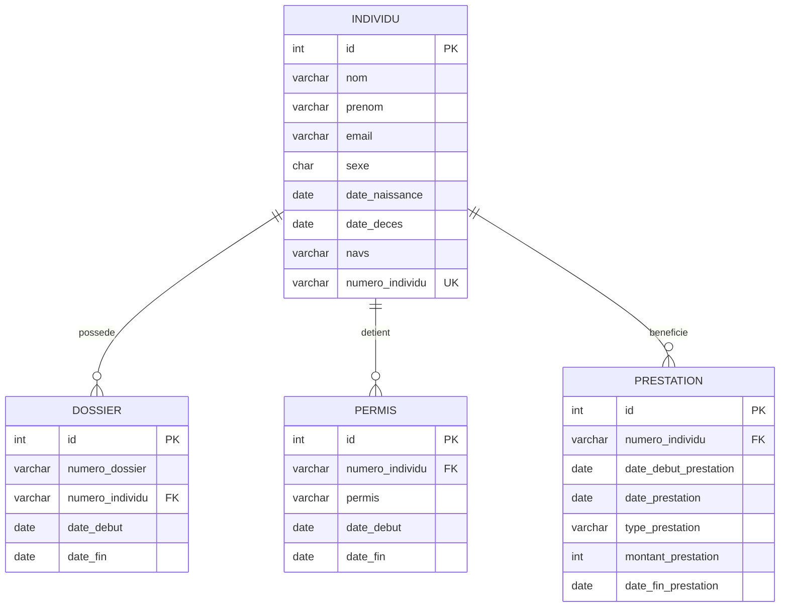

# benefits-dataset

Stack Docker pour charger un jeu de données dans PostgreSQL et l’explorer via pgAdmin.

## Contenu

- PostgreSQL (image personnalisée avec import CSV automatique)
- pgAdmin (interface web d’administration)
- 4 jeux de données CSV importés dans le schéma `src` de la base `pocs`

## Structure

- `data/` : fichiers CSV source
- `docker/postgres/Dockerfile` : image Postgres custom
- `docker/postgres/init/01-init.sql` : création schéma/tables + import
- `docker-compose.yml` : orchestration des services

## Prérequis

- Docker Desktop (ou Docker Engine + Compose)

## Démarrage rapide

```bash
docker compose up -d --build
```

## Accès

### PostgreSQL (depuis la machine hôte)

- Host: `localhost`
- Port: `5433`
- Database: `pocs`
- Schema: `src`
- User: `user`
- Password: `password`

### pgAdmin

- URL: `http://localhost:5050`
- Email: `admin@admin.com`
- Password: `admin`

## Connexion serveur dans pgAdmin

Créer un serveur avec:

- Name: `benefits-dataset-db`
- Hostname/address: `postgres`
- Port: `5432`
- Maintenance database: `pocs`
- Username: `user`
- Password: `password`

## Tables chargées

- `src.individu`
- `src.dossier`
- `src.permis`
- `src.prestation`

## Schéma MCD



## Rechargement complet des données

L’import CSV ne se fait qu’à l’initialisation du volume Postgres.

Pour repartir de zéro:

```bash
docker compose down -v
docker compose up -d --build
```

## Arrêt

```bash
docker compose down
```
